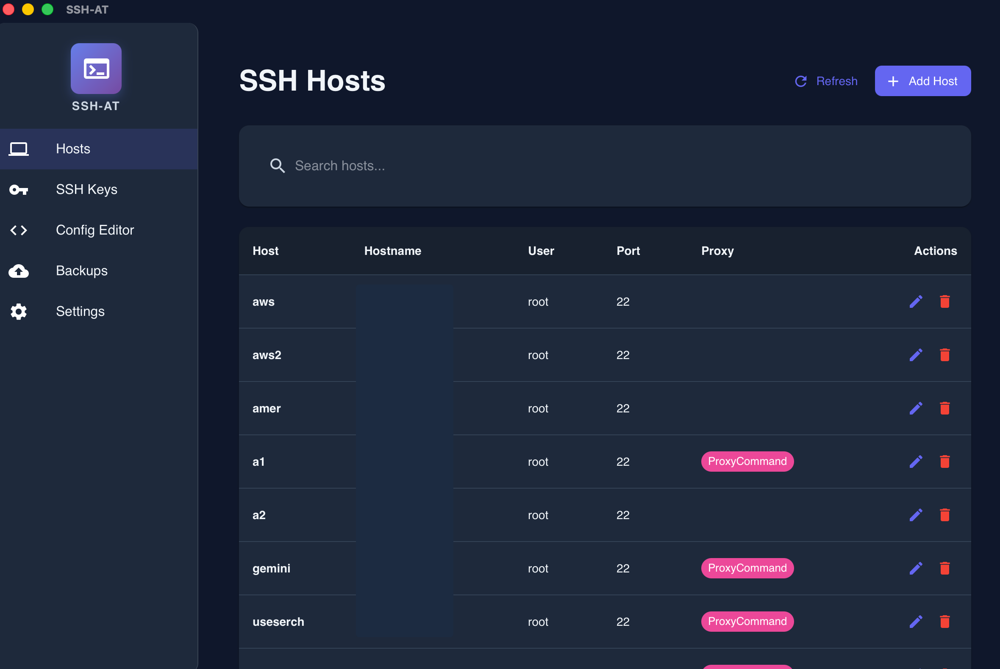
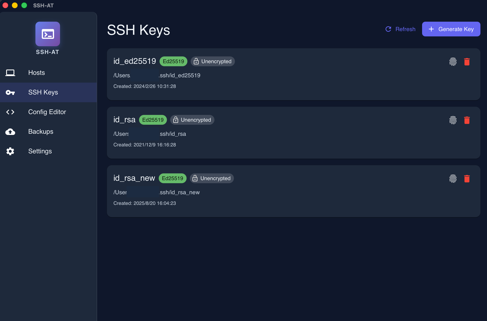
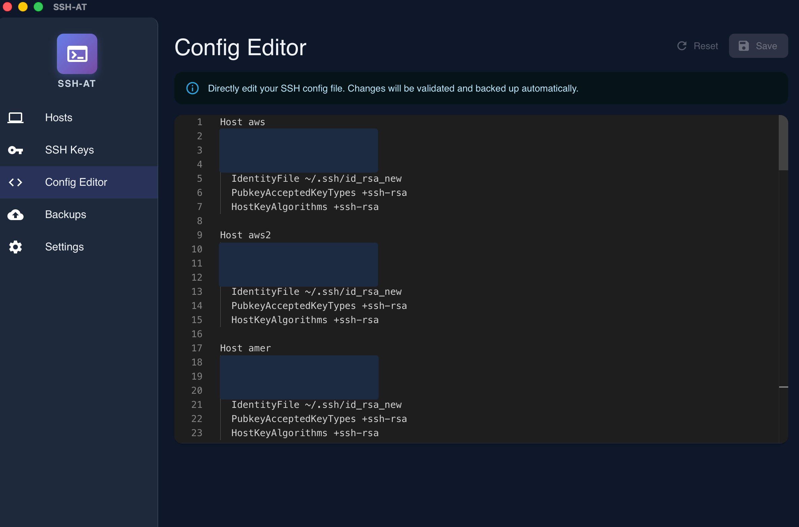
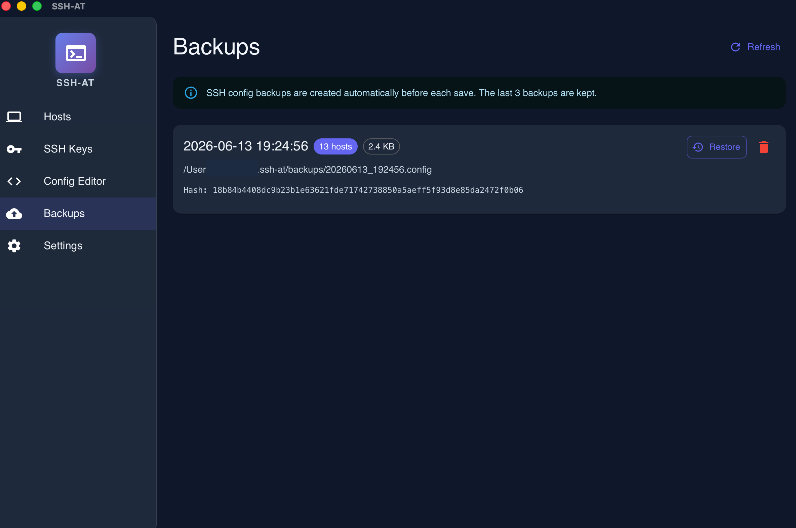
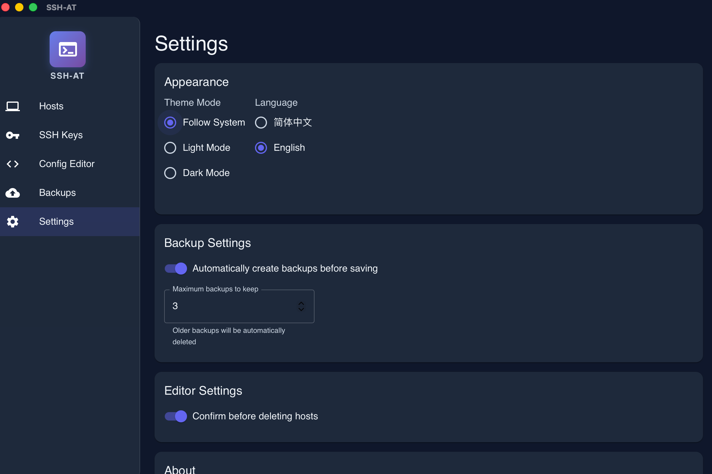

# SSH-AT

[English](./README.md)

## 概述

**SSH-AT** 是一个 SSH 密钥、主机和配置管理的桌面工具。生成密钥、可视化编辑 `~/.ssh/config`、自动备份——都在一个应用里。

基于 Tauri 2、React 和 Rust 构建的跨平台原生应用。

## 功能特性

- **📝 SSH 配置管理**
  - `~/.ssh/config` 可视化编辑器
  - 添加、编辑、删除和搜索 SSH 主机
  - Monaco Editor 实时语法高亮
  - 每次保存前自动备份

- **🔑 SSH 密钥管理**
  - 生成 SSH 密钥（RSA、Ed25519、ECDSA）
  - 查看密钥指纹
  - 一键复制公钥到剪贴板
  - 带确认的密钥删除

- **💾 备份与恢复**
  - 自动时间戳备份
  - 浏览和恢复历史配置
  - 删除旧备份

- **🌍 多语言支持**
  - 英文 / 中文
  - 自动检测系统语言

- **🎨 现代化界面**
  - Material Design（MUI）
  - 明暗主题切换
  - 系统托盘集成（最小化到托盘，不退出）
  - macOS Dock 图标在最小化时自动隐藏

## 界面截图

### 主机管理


### SSH 密钥


### 配置编辑器


### 备份管理


### 设置


## 技术栈

**前端：**
- React 19 + TypeScript
- Material-UI (MUI)
- Monaco Editor
- React Router
- React Query
- i18next

**后端：**
- Rust
- Tauri 2
- Tokio（异步运行时）
- 自定义 SSH 配置解析器

**构建：**
- Vite
- pnpm

## 安装

### 下载预编译版本

前往 [Releases](https://github.com/baerwang/ssh-at/releases) 下载：

- **macOS**：`.dmg`（Intel 和 Apple Silicon 通用二进制）
- **Windows**：`.msi`
- **Linux**：`.AppImage` 或 `.deb`

### 从源码构建

**前置要求：**
- Node.js 20+
- pnpm 8+
- Rust 1.70+
- 平台特定依赖：
  - **macOS**：Xcode 命令行工具、`create-dmg`（`brew install create-dmg`）
  - **Linux**：`libgtk-3-dev libwebkit2gtk-4.1-dev libayatana-appindicator3-dev librsvg2-dev patchelf`
  - **Windows**：WebView2（Windows 10+ 通常预装）

**构建步骤：**

```bash
# 克隆仓库
git clone https://github.com/baerwang/ssh-at.git
cd ssh-at

# 安装依赖
pnpm install

# 开发模式
pnpm tauri dev

# 生产构建
pnpm tauri build
```

构建产物：
- macOS：`src-tauri/target/release/bundle/macos/SSH-AT.app` 和 `.dmg`
- Windows：`src-tauri/target/release/bundle/msi/*.msi`
- Linux：`src-tauri/target/release/bundle/appimage/*.AppImage` 和 `.deb`

## 使用方法

1. **启动应用**
   - macOS：将 `SSH-AT.app` 拖到 `/Applications` 并启动
   - Windows：运行 `.msi` 安装程序
   - Linux：将 `.AppImage` 设为可执行并运行，或安装 `.deb`

2. **管理 SSH 主机**
   - 进入 **主机 (Hosts)** 标签
   - 点击 **+** 添加新主机
   - 内联编辑或使用 **配置编辑器** 进行原始编辑

3. **生成 SSH 密钥**
   - 进入 **密钥 (Keys)** 标签
   - 点击 **生成密钥**
   - 选择算法（推荐 Ed25519）、名称、密码短语
   - 密钥保存到 `~/.ssh-at/creds/`

4. **备份**
   - 访问 **备份 (Backups)** 标签查看所有自动备份
   - 根据需要恢复或删除

5. **设置**
   - 切换主题（明/暗）
   - 切换语言（英文/中文）
   - 打开配置目录

## 许可证

Apache 2.0
